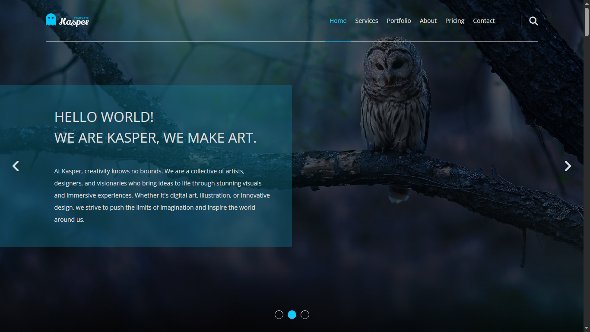

# Kasper-Inspired One Page Website

A responsive one-page website built with HTML, CSS, and JavaScript (Will be added later), inspired by the [Kasper PSD template](https://www.graphberry.com/item/kasper-one-page-psd-template) by Graphberry.

## 🖥️ Live Demo

## 📸 Screenshots

## 🚀 Features

- Fully responsive design
- Smooth scrolling navigation
- Interactive testimonials section
- Clean and modern layout

## 🧰 Technologies Used

- HTML5
- CSS3
- JavaScript (will be added later)

## 📄 License & Credits

This project utilizes design resources from the [Kasper One Page PSD Template](https://www.graphberry.com/item/kasper-one-page-psd-template) by Graphberry.

- The original design is free for personal and commercial use.
- Redistribution of the original PSD file is not permitted.
- All assets have been used in compliance with [Graphberry's license](https://www.graphberry.com/pages/license).
- Special thanks to Graphberry for providing high-quality design resources.

## 🙋‍♂️ Author

**Majed Abumathkour**

🎓 Computer Science Student  
💻 Aspiring Full-Stack Web Developer  

🔗 **Connect with me**:  
-   
- 
